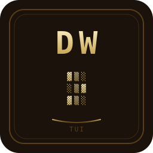

<div align="center">
  
</div>

# deep-world-tui

A terminal **procedural life-RPG** in the Deep World (Rust + ratatui). Nothing is
hand-placed: the world, its people, and *you* are sampled from lore-grounded
weighted charts. Live an organic life — a people, a town, a family, a trade — or
walk away from it to wander, and live with what that costs. Same seed → same world.

Siblings: [`deep-world-archive`](https://github.com/mtclab/deep-world-archive) (web
CRPG), [`deep-world-godot`](https://github.com/mtclab/deep-world-godot) (open-world).
Source world: [`deep-world-history`](https://github.com/mtclab/deep-world-history).

## Play

Download the latest release for your platform:

| Platform | File |
|----------|------|
| Linux (x86_64) | `deep-world-tui-x86_64-linux` |
| Windows (x86_64) | `deep-world-tui-x86_64-windows.exe` |

[All releases](https://github.com/mtclab/deep-world-tui/releases)

### Linux

```bash
chmod +x deep-world-tui-x86_64-linux
./deep-world-tui-x86_64-linux              # random seed each run
./deep-world-tui-x86_64-linux --seed 1234  # deterministic world
```

### Windows

```
deep-world-tui-x86_64-windows.exe              :: random seed
deep-world-tui-x86_64-windows.exe --seed 1234  :: deterministic world
```

### From source

```bash
curl --proto '=https' --tlsv1.2 -sSf https://sh.rustup.rs | sh -s -- -y && . "$HOME/.cargo/env"
cargo run -- --seed 1234
cargo test
cargo run --no-default-features  # no LLM (default play is LLM-off anyway)
```

## Docs

- `docs/DESIGN.md` — vision + pillars
- `docs/GENERATION.md` — the possibility-chart engine (the heart)
- `docs/CONSEQUENCES.md` — freedom + consequence (the spine)
- `docs/ARCHITECTURE.md` — Rust crate layout + build order + tests
- `data/charts.ron` — starter lore-grounded charts
- `AGENTS.md` — build/verify/canon rules for contributors

## License

MIT — see [LICENSE](LICENSE).